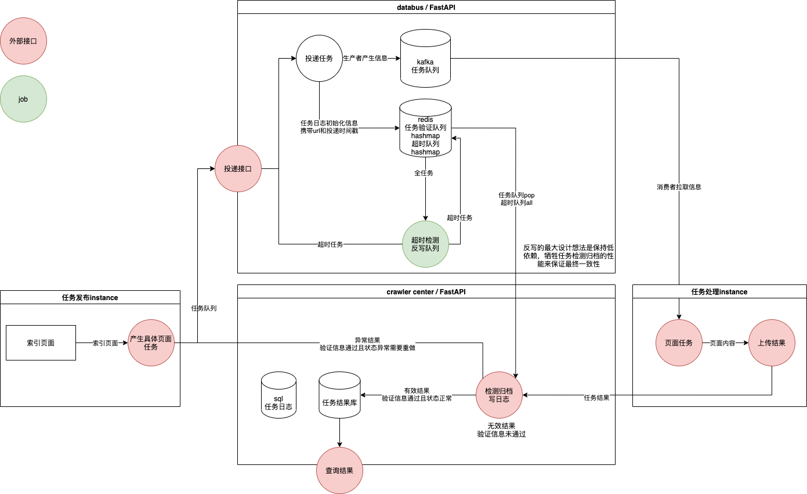

# TaxCreeper V3
## 数据流图

## 任务队列data bus 
- 目前进度：基于Kafka和FastAPI全面重构，进行中，80%
- 明确一点：同一时间，允许多个重复url，因为databus本身并不负责爬取结果最新时效性的查验
- TODO：  
    - 原始日志系统 【未计划】
    - 任务投递 【已完成】
    - 超时任务检测，目前方案为单开进程 【已完成】
    
## 控制中心
- 目前进度：设计完成，等待施工 
- 目前进度：
- TODO：
    - 主库同步 【未开始】
    - 协程优化，v2 【已完成】
    - 结果异常检测 【未开始】
    - 保证结果最新，写入另开进程查询post_date和mission_time，对比双时间再决定 【未开始】
  

## 爬虫端重构
- 目前进度：
- TODO：
    - 协程优化，v2 【v2阶段已完成】
    - 结果异常检测 【未开始】